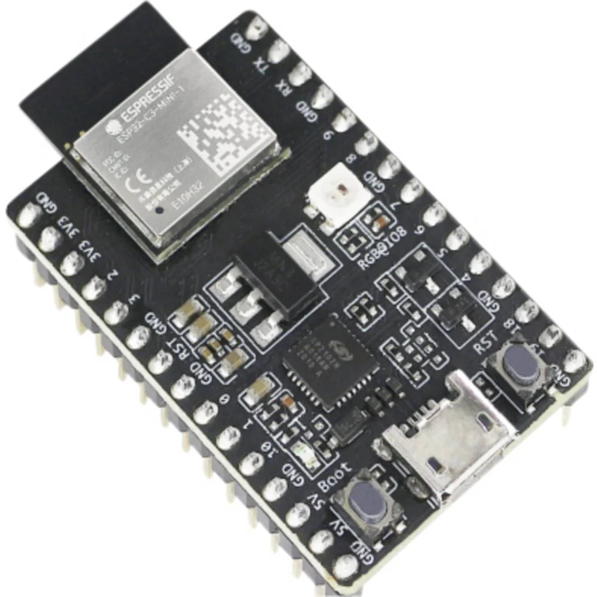
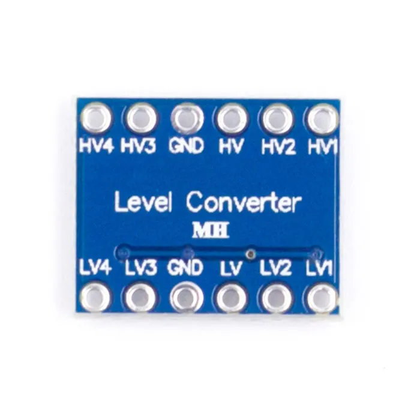

# Componenten

# 1: Voeding
</img>

Ingangsspanning: 90 - 264V AC 
Uitgangsspanning: 5V DC 
Uitgangsstroom max: 5A 
Vermogen: 25W 

We plaatsen twee exemplaren in parallel om onze leds en controller te voeden. 
We houden in gedacht dat onze leds nooit allemaal op hetzelfde moment zullen oplichten, dus dit is meer dan voldoende. 

# 2: Controller
</img>

Om onze leds aan te sturen, maken we gebruik van de ESP32-C3, een controller waarmee we reeds vertrouwd zijn. 

Dit toestel werkt op een spanning van 3.3V, heeft een USB-interface en 22 GPIO-pinnen wat meer dan genoeg is voor dit project.

# 3: Level Shifter
</img>

Omdat de spanning van onze controller (3.3V) verschilt met de spanning waarop onze LEDs werken (5V), hebben we level shifters nodig om de spanningen juist om te zetten.

Deze level shifter kan omzettingen doen tussen: 
*1.8V 
*2.8V 
*3.3V 
*5V 

# 4: Ledstrip

De box waarmee we werken zal een afmeting hebben van 850x850mm, dus om zeker te zijn
dat we genoeg LEDS hebben, inclusief voor testen, kiezen we voor 2x 5 meter ledstrips.

Deze ledstrips zijn voorzien van een tape op de achterkant, waardoor we ze makkelijk kunnen bevestigen
aan de plaat. Ook zijn ze knipbaar op elke LED, wat ons veel flexibiliteit biedt. Per meter zijn er 30 LEDS, waardoor we in totaal beschikken over 300 LEDS.

Ingangsspanning: 5V  
Max. vermogen per LED: 60mA  
Max. vermogen per meter: 1.8A / 9W  
WS2813 chip 
30 LEDs per meter 

