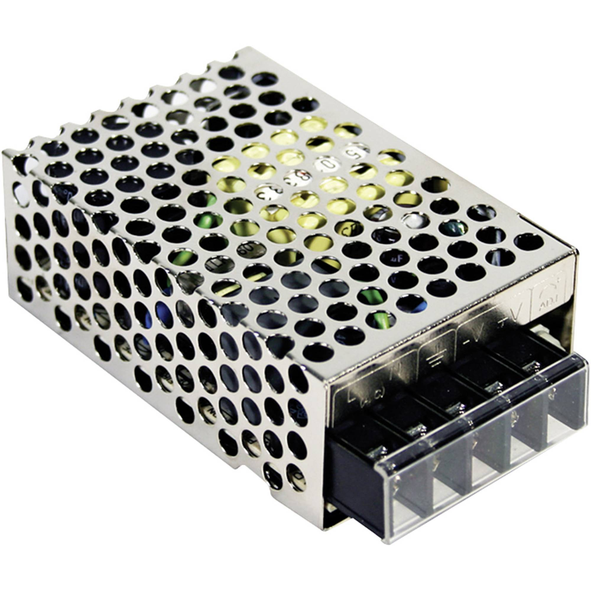
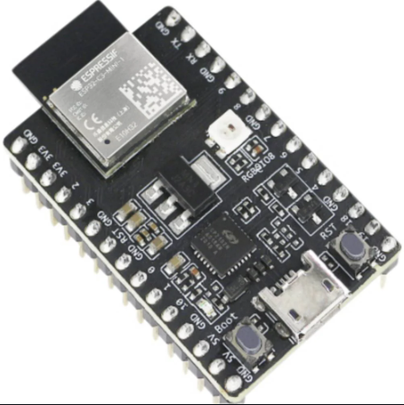
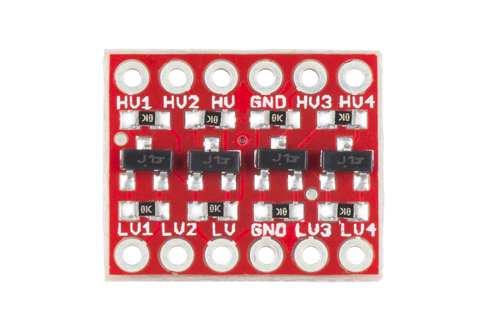
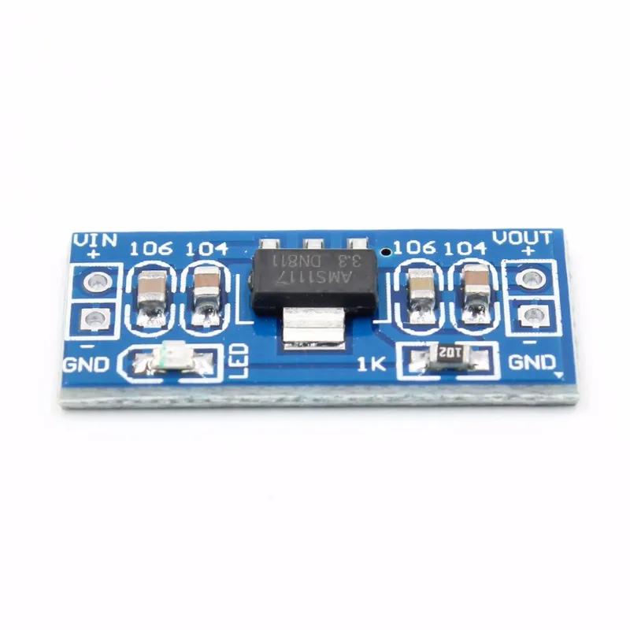
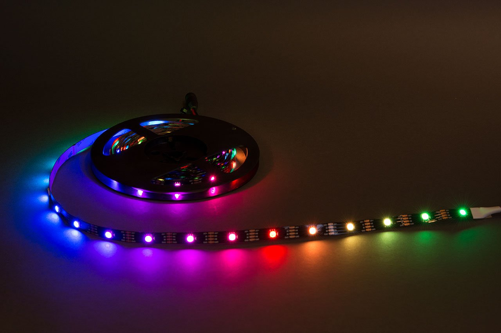

### 1. Voeding (2x)

**Description:**

The power supply unit provides power to the LEDs and the controller. Two units are used in parallel to ensure sufficient power supply.

**Specs:**
- Input Voltage: 90 - 264V AC
- Output Voltage: 5V DC
- Maximum Output Current: 5A
- Power: 25W

### 2. Controller

**Description:**

The ESP32-C3 controller is used to control the LEDs. It operates at 3.3V and has a USB interface and 22 GPIO pins.

**Specs:**
- Operating Voltage: 3.3V
- Interfaces: USB
- GPIO Pins: 22

### 3. Level Shifter

**Description:**

The level shifter is used to convert digital signals from the 3.3V controller to the 5V required by the LEDs. It is bidirectional and supports various voltage levels.

**Specs:**
- Supported Voltage Levels: 1.8V, 2.8V, 3.3V, 5V
- Maximum Operational Frequency: 1MHz

### 4. Spanningsomvormer (Voltage Regulator)

**Description:**

The voltage regulator converts the 5V input voltage to a stable 3.3V output voltage required by the microcontroller.

**Specs:**
- Input Voltage Range: DC 4.5 - 7V
- Output Voltage: 3.3V
- Maximum Output Current: 800mA

### 5. Ledstrip

**Description:** (2x)

The LED strips are used for illumination and are mounted on the panel. Two 5-meter strips are chosen for the project.

**Specs:**
- Input Voltage: 5V
- Maximum Power per LED: 60mA
- Maximum Power per Meter: 1.8A / 9W
- LED Chip: WS2813
- LEDs per Meter: 30
- LENGTHE: 5 Meter

[MAIN README](../README.md)
