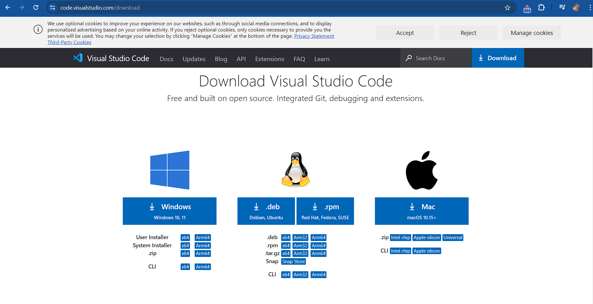
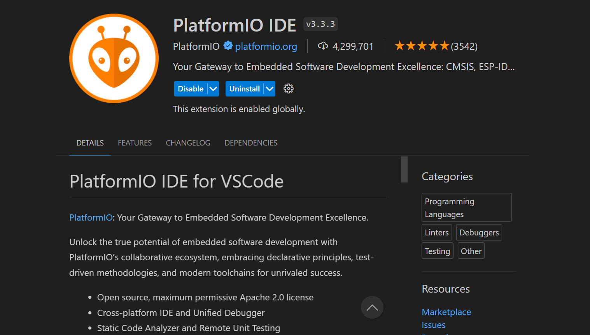
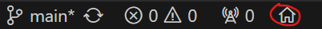
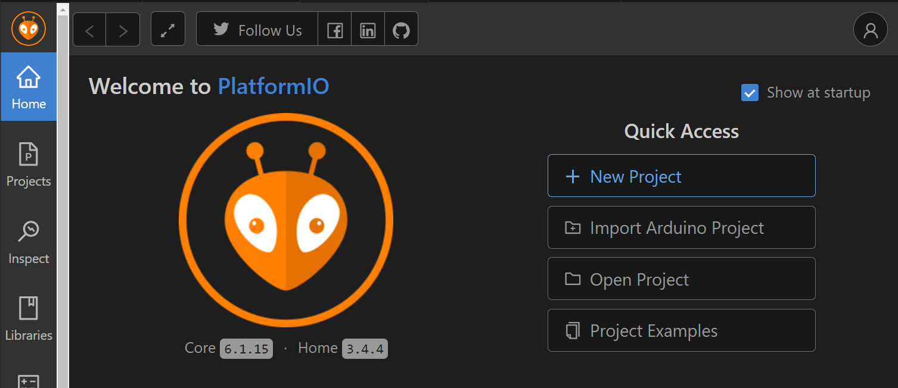
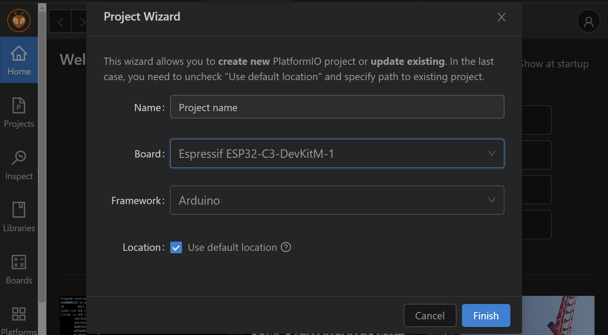

<h1>Software</h1>
<h2> Visual Studio Code </h2>
Visual Studio Code is een open-scource code editor die veel programmeringstalen ondersteunt.
Op de site van Visual Studio Code kan je het downloaden voor Windows(versie 10 of 11), Linux(Debian, Ubuntu, Red Hat, ...) en Mac OS.

<h2> PlatformIO </h2>

 Het programma voor dit project werd geschreven in C++. Aangezien we gebruik maken van leds die we wensen aan te sturen, gebruiken we verschillende externe libraries, waaronder de bekende Adafruit_Neopixel library. Als we deze library willen gebruiken, hebben we nood aan de PlatformIO extensie.

 Vervolgens open je PlatformIO, dit doe je door op het huis-icoon te klikken links onderaan in Visual Studio Code.

 Kies dan voor "New Project". Geef je project een naam, selecteer het bordje (ESP32-c3 Devkit M1) en het framework (Arduino) en kies dan voor "Finish".

Vervolgens importeren we de Adafruit_Neopixel library via het PIO menu; links kies je de optie 'libraries' en in de zoekbalk typ je de naam. 

Verder voeg je ook nog NTPClient en WiFiUdp toe, op dezelfde manier.

<h2> Main File </h2>
We kaarten de belangrijkste punten uit de code even aan:

- Er wordt verbinding met WiFi gemaakt, waarna de TimeClient, buttons en de leds worden geïnitialiseerd.
- De huidige tijd wordt opgehaald via een database op het internet, die tijd wordt dan vervolgens omgezet naar binary code en dan, door middel van een for loop, op de ledstrips gezet.
- Functionaliteit van de buttons worden daarna beschreven door middel van een reeks if-statements. Hier worden de kleurwaarden ook aangepast, naargelang welke knop actief is.
- Een test programma is inbegrepen, waarbij alle leds tegelijk aangestuurd worden.

[MAIN README](../README.md)

